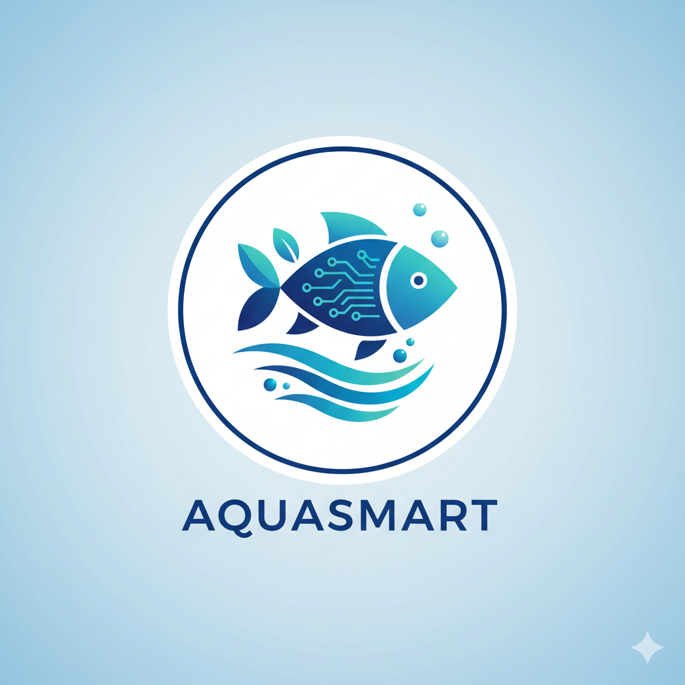
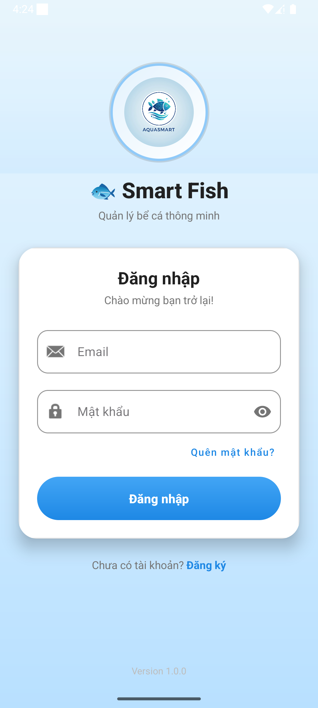
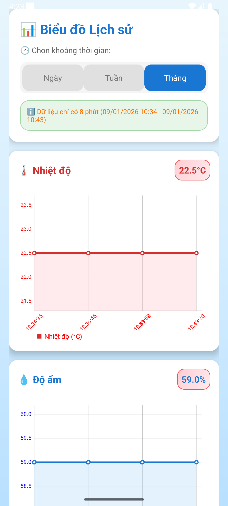

# 🐟 SmartFish - Ứng Dụng Quản Lý Bể Cá Thông Minh

<p align="center">
  
</p>

## 📖 Giới Thiệu

**SmartFish** là ứng dụng Android giúp giám sát và điều khiển hệ thống bể cá thông minh từ xa. Ứng dụng kết nối với thiết bị IoT (ESP32) thông qua nền tảng **ThingsBoard Cloud** để theo dõi các thông số môi trường và điều khiển các thiết bị phụ trợ.

## ✨ Tính Năng Chính

### 📊 Giám Sát Thời Gian Thực
- **Nhiệt độ nước** - Theo dõi nhiệt độ bể cá theo thời gian thực
- **Độ ẩm** - Đo độ ẩm môi trường xung quanh
- **Mực nước** - Kiểm tra mức nước trong bể (cm)

### 🎮 Điều Khiển Thiết Bị
- **💡 Điều chỉnh độ sáng đèn LED** - Thanh trượt từ 0-255
- **🎨 Chọn màu đèn LED** - Color Picker với nhiều màu sắc
- **🐠 Cho cá ăn tự động** - Gửi lệnh RPC điều khiển máy cho ăn

### 📈 Biểu Đồ Lịch Sử
- Xem biểu đồ nhiệt độ và độ ẩm theo thời gian
- Lựa chọn khoảng thời gian: **24 giờ**, **7 ngày**, **30 ngày**
- Hiển thị giá trị trung bình

### 🔔 Cảnh Báo Thông Minh
- **Cảnh báo nhiệt độ**: Khi nước quá nóng (>32°C) hoặc quá lạnh (<20°C)
- **Cảnh báo mực nước**: Khi hết nước (<10cm) hoặc tràn nước (>150cm)
- Push notification với âm thanh và rung

### ⚙️ Cài Đặt Hệ Thống
- Cấu hình chiều cao bể
- Ngưỡng bật/tắt máy sưởi (heater)
- Ngưỡng bật/tắt máy bơm

## 🏗️ Kiến Trúc Hệ Thống

```
┌─────────────────┐      ┌──────────────────┐      ┌─────────────────┐
│   SmartFish     │◄────►│   ThingsBoard    │◄────►│     ESP32       │
│   Android App   │ WSS  │   Cloud Server   │ MQTT │   (IoT Device)  │
└─────────────────┘      └──────────────────┘      └─────────────────┘
        │                                                   │
        │                                                   ▼
        │                                         ┌─────────────────┐
        │                                         │   Cảm Biến &    │
        │                                         │   Thiết Bị      │
        │                                         │  • DHT22        │
        │                                         │  • Ultrasonic   │
        │                                         │  • LED Strip    │
        │                                         │  • Servo Motor  │
        ▼                                         └─────────────────┘
┌─────────────────┐
│   Người Dùng    │
│   📱 Android    │
└─────────────────┘
```

## 🛠️ Công Nghệ Sử Dụng

### Android
| Công nghệ | Phiên bản | Mô tả |
|-----------|-----------|-------|
| **Kotlin** | 1.9+ | Ngôn ngữ lập trình chính |
| **Android SDK** | 35 (Min: 24) | Nền tảng phát triển |
| **Coroutines** | 1.7.3 | Xử lý bất đồng bộ |
| **Retrofit** | 2.9.0 | HTTP Client |
| **OkHttp** | 4.12.0 | WebSocket & HTTP |
| **Kotlinx Serialization** | 1.6.0 | JSON parsing |
| **MPAndroidChart** | 3.1.0 | Biểu đồ |
| **Lottie** | 6.4.0 | Animation |
| **ColorPicker** | 2.3 | Bộ chọn màu |
| **Material Design** | 1.13.0 | UI Components |

### Backend & IoT
| Công nghệ | Mô tả |
|-----------|-------|
| **ThingsBoard Cloud** | IoT Platform |
| **WebSocket (WSS)** | Real-time data |
| **REST API** | RPC Commands |
| **ESP32** | Microcontroller |
| **MQTT** | IoT Protocol |

## 📁 Cấu Trúc Dự Án

```
app/src/main/java/com/example/smartfish/
├── 📄 MainActivity.kt          # Màn hình đăng nhập
├── 📄 DashboardActivity.kt     # Màn hình chính (giám sát & điều khiển)
├── 📄 ChartActivity.kt         # Màn hình biểu đồ lịch sử
├── 📄 SettingsActivity.kt      # Màn hình cài đặt
├── 📄 SessionManager.kt        # Quản lý token (SharedPreferences)
├── 📄 RetrofitClient.kt        # Cấu hình Retrofit HTTP Client
├── 📄 ThingsBoardApi.kt        # API Interface definitions
├── 📄 LoginRequest.kt          # Data class cho request đăng nhập
└── 📄 LoginResponse.kt         # Data class cho response đăng nhập
```

```
app/src/main/res/
├── layout/
│   ├── activity_main.xml       # Layout đăng nhập
│   ├── activity_dashboard.xml  # Layout dashboard
│   ├── activity_chart.xml      # Layout biểu đồ
│   └── activity_settings.xml   # Layout cài đặt
└── drawable/                    # Icons, backgrounds, gradients
```

## 🚀 Hướng Dẫn Cài Đặt

### Yêu Cầu
- **Android Studio** Hedgehog (2023.1.1) hoặc mới hơn
- **JDK 11** trở lên
- **Android SDK 35**
- Thiết bị/emulator Android **API 24+** (Android 7.0+)

### Các Bước Cài Đặt

1. **Clone repository**
   ```bash
   git clone https://github.com/your-username/smartfish.git
   cd smartfish
   ```

2. **Mở project trong Android Studio**
   - File → Open → Chọn thư mục project

3. **Cấu hình ThingsBoard**
   - Đăng ký tài khoản tại [ThingsBoard Cloud](https://thingsboard.cloud)
   - Tạo Device và lấy **Device ID**
   - Cập nhật `DEVICE_ID` trong `DashboardActivity.kt`:
   ```kotlin
   private val DEVICE_ID = "your-device-id-here"
   ```

4. **Build và chạy**
   ```bash
   ./gradlew assembleDebug
   ```
   Hoặc nhấn **Run** (▶️) trong Android Studio

## 📱 Hướng Dẫn Sử Dụng

### 1. Đăng Nhập
- Mở ứng dụng và nhập **email** & **password** của tài khoản ThingsBoard
- Nhấn nút **Đăng nhập**
- Token sẽ được lưu tự động cho lần sau

### 2. Dashboard (Màn Hình Chính)
| Thành phần | Chức năng |
|------------|-----------|
| 🌡️ **Nhiệt độ** | Hiển thị nhiệt độ nước hiện tại |
| 💧 **Độ ẩm** | Hiển thị độ ẩm môi trường |
| 📏 **Mực nước** | Hiển thị mức nước trong bể |
| 🔆 **Thanh trượt** | Điều chỉnh độ sáng đèn LED |
| 🎨 **Nút màu** | Mở bảng chọn màu đèn |
| 🐟 **Nút cho ăn** | Kích hoạt servo cho cá ăn |
| 📊 **Nút biểu đồ** | Xem lịch sử dữ liệu |
| ⚙️ **Nút cài đặt** | Mở trang cài đặt |

### 3. Biểu Đồ Lịch Sử
- Chọn khoảng thời gian: **24h** / **7 ngày** / **30 ngày**
- Xem biểu đồ nhiệt độ (màu đỏ) và độ ẩm (màu xanh)
- Xem giá trị trung bình

### 4. Cài Đặt
- Điều chỉnh ngưỡng bật/tắt cho máy sưởi và máy bơm
- Nhấn **Lưu** để ghi nhớ hoặc **Đồng bộ** để gửi lên thiết bị

## 🔌 API Endpoints

### Authentication
```http
POST /api/auth/login
Content-Type: application/json

{
  "username": "email@example.com",
  "password": "your-password"
}
```

### RPC Commands
```http
POST /api/plugins/rpc/oneway/{deviceId}
X-Authorization: Bearer {token}
Content-Type: application/json

{
  "method": "setBrightness",
  "params": "128"
}
```

**Các method RPC hỗ trợ:**
| Method | Params | Mô tả |
|--------|--------|-------|
| `setLight` | `"true"` / `"false"` | Bật/tắt đèn |
| `setBrightness` | `"0"` - `"255"` | Độ sáng |
| `setColor` | `"#RRGGBB"` | Màu LED |
| `feedFish` | `"true"` | Cho cá ăn |

### WebSocket (Telemetry)
```
wss://eu.thingsboard.cloud/api/ws/plugins/telemetry?token={token}
```

**Subscription message:**
```json
{
  "tsSubCmds": [{
    "entityType": "DEVICE",
    "entityId": "{deviceId}",
    "scope": "LATEST_TELEMETRY",
    "cmdId": 1
  }],
  "historyCmds": [],
  "attrSubCmds": []
}
```

### Telemetry History
```http
GET /api/plugins/telemetry/DEVICE/{deviceId}/values/timeseries?keys={keys}&startTs={startTs}&endTs={endTs}
X-Authorization: Bearer {token}
```

## 📊 Dữ Liệu Telemetry

| Key | Kiểu | Đơn vị | Mô tả |
|-----|------|--------|-------|
| `nhietDo` | Float | °C | Nhiệt độ nước |
| `doAm` | Float | % | Độ ẩm |
| `mucNuoc_cm` | Float | cm | Mực nước |

## ⚠️ Cấu Hình Ngưỡng Cảnh Báo

```kotlin
// Trong DashboardActivity.kt
private val TEMP_MAX = 32.0f        // Nhiệt độ tối đa (°C)
private val TEMP_MIN = 20.0f        // Nhiệt độ tối thiểu (°C)
private val WATER_LEVEL_MIN = 10.0f // Mực nước tối thiểu (cm)
private val WATER_LEVEL_MAX = 150.0f// Mực nước tối đa (cm)
private val ALERT_COOLDOWN = 60000L // Thời gian chờ giữa 2 cảnh báo (ms)
```

## 🎨 Screenshots

| Đăng nhập | Dashboard | Biểu đồ | Cài đặt |
|:---------:|:---------:|:-------:|:-------:|
|  |  |  |  |

## 🔧 Phát Triển Trong Tương Lai

- [ ] 🔐 Tính năng tự động đăng nhập
- [ ] 📅 Lập lịch cho cá ăn tự động
- [ ] 🌐 Hỗ trợ đa ngôn ngữ (i18n)
- [ ] 📷 Camera giám sát bể cá
- [ ] 🤖 AI phát hiện bất thường
- [ ] ☁️ Backup dữ liệu lên cloud
- [ ] 👥 Hỗ trợ nhiều bể cá/thiết bị
- [ ] 🔔 Tùy chỉnh ngưỡng cảnh báo trong app

## 🐛 Xử Lý Sự Cố

### Không kết nối được ThingsBoard
1. Kiểm tra kết nối mạng
2. Kiểm tra token còn hiệu lực không
3. Kiểm tra Device ID đúng chưa

### Không nhận được dữ liệu real-time
1. Kiểm tra WebSocket connection
2. Kiểm tra ESP32 đang gửi dữ liệu
3. Xem log trong Android Studio

### Lỗi gửi lệnh RPC
1. Kiểm tra ESP32 đang online
2. Kiểm tra method name khớp với code ESP32
3. Kiểm tra quyền trên ThingsBoard

## 👨‍💻 Tác Giả

Nguyễn Đức Thắm

## 📄 Giấy Phép

Dự án này được phân phối dưới giấy phép **MIT License**.

```
MIT License

Copyright (c) 2026 SmartFish

Permission is hereby granted, free of charge, to any person obtaining a copy
of this software and associated documentation files (the "Software"), to deal
in the Software without restriction, including without limitation the rights
to use, copy, modify, merge, publish, distribute, sublicense, and/or sell
copies of the Software, and to permit persons to whom the Software is
furnished to do so, subject to the following conditions:

The above copyright notice and this permission notice shall be included in all
copies or substantial portions of the Software.

THE SOFTWARE IS PROVIDED "AS IS", WITHOUT WARRANTY OF ANY KIND, EXPRESS OR
IMPLIED, INCLUDING BUT NOT LIMITED TO THE WARRANTIES OF MERCHANTABILITY,
FITNESS FOR A PARTICULAR PURPOSE AND NONINFRINGEMENT. IN NO EVENT SHALL THE
AUTHORS OR COPYRIGHT HOLDERS BE LIABLE FOR ANY CLAIM, DAMAGES OR OTHER
LIABILITY, WHETHER IN AN ACTION OF CONTRACT, TORT OR OTHERWISE, ARISING FROM,
OUT OF OR IN CONNECTION WITH THE SOFTWARE OR THE USE OR OTHER DEALINGS IN THE
SOFTWARE.
```

---

<p align="center">
  Made with ❤️ for Fish Lovers 🐠
</p>

